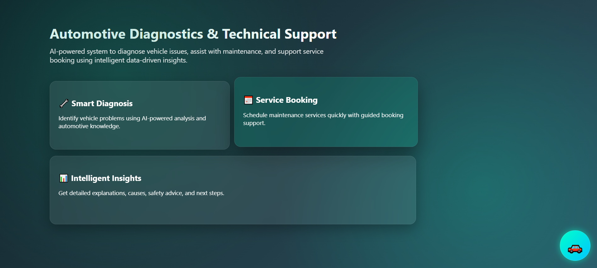
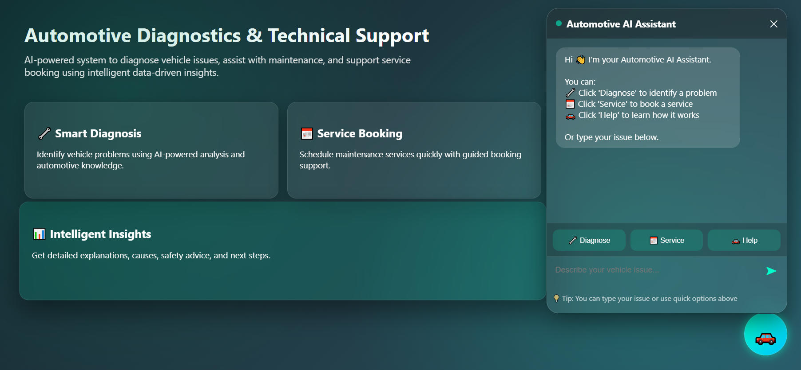
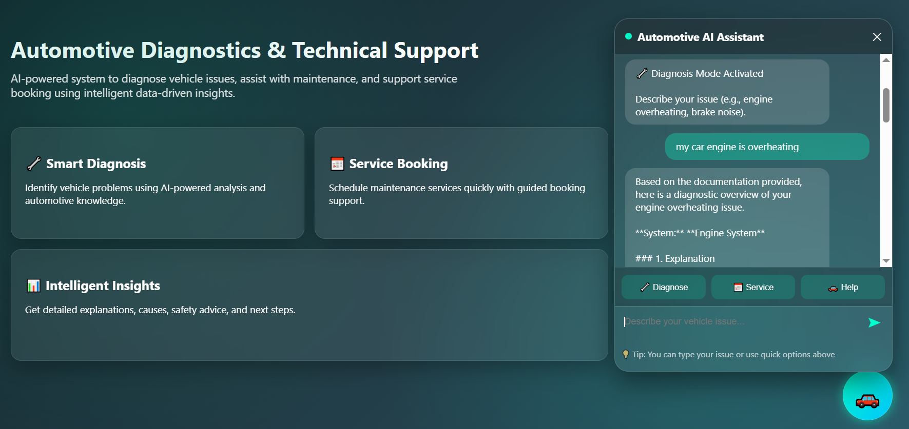

# 🚗 AI-Powered Automotive Diagnostic Chatbot using RAG and Gemini LLM

##  Overview

This project is a hybrid AI-based automotive diagnostic chatbot developed as part of an MSc dissertation project.

The system combines:
- Rule-based intent handling for simple queries
- Retrieval-Augmented Generation (RAG) for retrieving relevant automotive knowledge
- Gemini Large Language Model (LLM) for generating structured and context-aware responses

The chatbot is designed to assist users and technicians in identifying vehicle-related issues more efficiently and accurately.

---

#  Live Demo

🔗 Live Demo: https://automotive-diagnostic-chatbot.onrender.com

---

#  Screenshots

## Homepage



## Chat Interface



## AI Diagnostic Response



---
#  Features

* Hybrid architecture (Rule-based + RAG + LLM)

*  Intent detection using keyword similarity

* Context-aware diagnostic responses

* Automotive knowledge retrieval using RAG

* Structured responses including:
- Problem explanation
- Possible causes
- Safety advice
- Recommended actions

* Chat history support

* Response caching

* Input validation

* Service booking flow

---

#  System Architecture

User Query  
↓  
Intent Detection  
↓  

Simple Query → Rule-Based System  

Complex Query → RAG Retrieval → Gemini LLM  

↓  

Structured Response Generation

---

#  Why RAG?

Large Language Models alone may generate generic or inaccurate responses.

RAG improves the system by:
- Retrieving domain-specific automotive knowledge
- Providing contextual grounding
- Reducing hallucination
- Improving response relevance and accuracy

---

#  Tech Stack

| Technology | Purpose |
|---|---|
| Python | Core programming language |
| Flask | Backend framework |
| Gemini LLM | Response generation |
| RAG | Context retrieval |
| JSON | Intent knowledge base |
| HTML/CSS/JavaScript | Frontend interface |

---

#  Run Locally

## Clone the repository

```bash
git clone https://github.com/YOUR_USERNAME/YOUR_REPO.git
```

## Navigate to project folder

```bash
cd YOUR_REPO
```

## Install dependencies

```bash
pip install -r requirements.txt
```

## Create .env file

Add your Gemini API key:

```env
GEMINI_API_KEY=your_api_key_here
```

## Run the application

```bash
python app.py
```

Open in browser:

```plaintext
http://127.0.0.1:5000
```


#  Project Structure

```plaintext
project/
│
├── app.py
├── rag_engine.py
├── intents.json
├── requirements.txt
├── README.md
│
├── templates/
│   └── index.html
│
├── static/
│   ├── style.css
│   └── chat.js
│
├── automotive_docs/
│
└── screenshots/
```


#  Future Improvements

- Voice-enabled diagnostics
- Real-time vehicle sensor integration
- Advanced vector database support
- Multi-language support
- Fine-tuned automotive LLM


# 📄 License

This project is developed for academic and educational purposes.